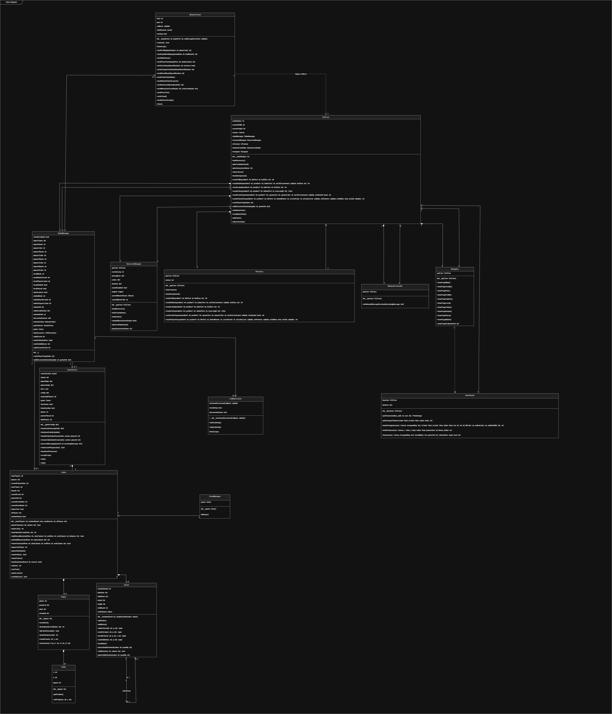
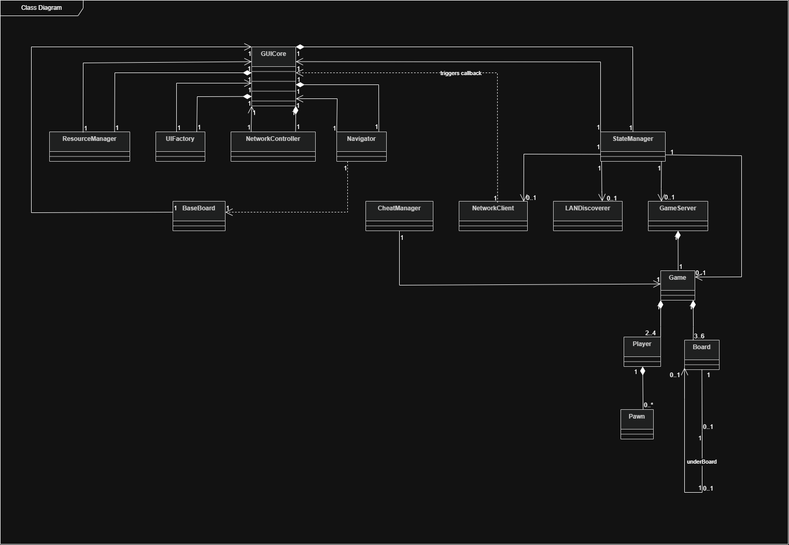
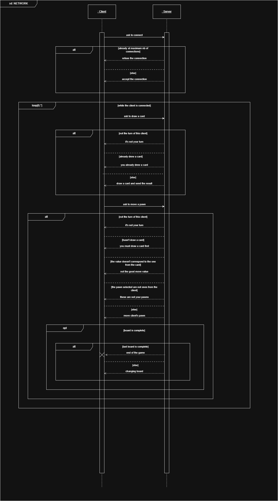

# Documentation technique
___
## Justification du langage et de la librairie graphique:

### Langage utilisé

Afin de réaliser ce projet, nous avons utilisé le langage **python** car nous estimions que celui-ci était le meilleur pour réaliser ce projet avec nos différentes capacités de codage. De plus, c'est également celui que nous avons le plus travaillé en cours.
___
### Librairies utilisées

#### Graphismes

Pour concrétiser l'aspect graphique du jeu "Mole in the Hole", nous avons utilisé la librairie **Tkinter** puisque c'est avec cette librairie qu'on a réalisé nos différents projets nécéssitant un aspect graphique et nous étions par conséquent plus à l'aise avec celle-ci.

Pour gérer les images, nous avons également utilisé la librairie **Pillow (Python Imaging library)** qui nous permet d'utiliser une plus grande variété de type d'images.

#### Audio

Afin de gérer toute la partie musique et effets sonores, nous avons dû utiliser la librairie **miniaudio**. En effet, n'ayant pas utilisé pygame comme librairie, nous n'avons pas pu avoir recours à tout l'aspect musical donné par cette librairie. Heureusement, miniaudio nous suffisait pour réaliser tout l'aspect sonore du projet à savoir:
- Ajouter de la musique
- Ajouter des effets sonores
___
## Architecture du projet:
```text
├── algo/ (tout les fichiers gérant l'algorithmie du projet)
│    ├── ai.py (gère le fonctionnement des différents bots pour le jeu)
│    ├── board.py (gère tout ce qui est lié au plateau)
│    ├── cheat.py (gère le cheat pour remplir les trous qui peut être activé ou non)
│    ├── game.py (gère tout le fonctionnement du jeu ainsi que les règles)
│    ├── pawn.py (gère les pions)
│    └── player.py (gère les joueurs)
├── assets/ (tout les fichiers utilisés pour gérer les thèmes et leurs assets graphiques correspondants ainsi que les langues)
│    ├── background/ (différents fonds (un par thème))
│    │      ├── background_desert.png
│    │      ├── background_ice_floe.png
│    │      ├── background_meadow.png
│    │      └── background_volcano.png
│    ├── documentation/ (toutes les images utilisées dans la doc technique)
│    ├── lang/ (différents fichiers pour chaque langue)
│    │      ├── de.json
│    │      ├── en.json
│    │      ├── es.json
│    │      ├── fr.json
│    │      └── it.json
│    ├── textures/ (différents assets graphiques de chaque thème)
│    │      ├── desert/
│    │      │    ├── pawns/ (toutes les variations de couleur pour les pions)
│    │      │    ├── bonus.png
│    │      │    └── hole.png
│    │      ├── ice_floe/
│    │      │    ├── pawns/ (toutes les variations de couleur pour les pions)
│    │      │    ├── bonus.png
│    │      │    └── hole.png
│    │      ├── meadow/
│    │      │    ├── pawns/ (toutes les variations de couleur pour les pions)
│    │      │    ├── bonus.png
│    │      │    └── hole.png
│    │      └── volcano/
│    │      │    ├── pawns/ (toutes les variations de couleur pour les pions)
│    │      │    ├── bonus.png
│    │      │    └── hole.png
│    └── themes/
│    │      └── themes.json (regroupement des assets graphiques pour chaque thème ainsi que la gestion des couleurs)
├── audio/
│    ├── music/ (les musiques jouées durant une partie (une version épique est joué sur le dernier plateau)
│    │      ├── desert/
│    │      ├── ice_floe/
│    │      ├── meadow/
│    │      ├── volcano/
│    ├── sound_effects/
│    │      ├── footsteps/ (bruits de pas pour chaque thème)
│    │      │    ├── desert/
│    │      │    ├── ice_floe/
│    │      │    ├── meadow/
│    │      │    └── volcano/
│    │      └── voices/
│    │      │    ├── area_secured.mp3 (son joué quand un pion va sur un trou)
│    │      │    ├── player_eliminated.mp3 (son joué quand un joueur est éliminé)
│    │      │    └── victory.mp3 (son joué quand un joueur gagne la partie)
│    ├── audioManager.py (fichier qui gère les différents flux sonores)
│    └── loopingStream.py (fichier qui gère la boucle musicale)
├── gui/
│    ├── board_views/ (dossier regroupant toutes les versions du plateau)
│    │      ├── baseBoard.py
│    │      ├── viewMatch.py
│    │      ├── viewPlace.py
│    │      └── viewRotate.py
│    ├── core/ (dossier gérant le coeur de l'interface graphique)
│    │      ├── Navigator.py (fichier gérant la navigation et l'affichage des différentes du jeu)
│    │      ├── NetworkController.py (fichier gérant la réception et l'interprétation des messages réseaux)
│    │      ├── ResourceManager.py (fichier de gestion des ressources du jeu (thème, langues, textures, sons))
│    │      ├── StateManager.py (fichier gérant toutes les variables d'état (joueurs, lobby, jeu en cours, réseau))
│    │      └── UIFactory.py (fichier s'occupant de la création et du rendu de l'interface utilisateur)
│    ├── launcher_pages/ (dossier regroupant les différents pages du launcher)
│    │      ├── pageCredits.py (fichier affichant la page des crédits)
│    │      ├── pageEnd.py (fichier affichant la page de fin du jeu)
│    │      ├── pageLocal.py (fichier affichant la page du jeu en local)
│    │      ├── pageMain.py (fichier affichant la page principale du launcher)
│    │      ├── pageOnline.py (fichier affichant la page du jeu en ligne)
│    │      ├── pageOptions.py (fichier affichant la page des options)
│    │      ├── pagePlay.py (fichier affichant la page lors du jeu)
│    │      └── pageProfile.py (fichier affichant la page de la gestion de profil)
│    └── GUICore.py (fichier gérant la fenêtre Tkinter et le canvas global)               
├── network/ (dossier contenant tout les fichiers liés au réseau)
│   ├── client.py (fichier gérant toutes les connexions clients et les requêtes au serveur)
│   ├── firewall.py (fichier gérant l'ouverture du port 5000)   
│   ├── getIps.py (fichier récupérant toutes les addresses IP de la machine serveur)
│   ├── LANDiscovery.py (fichier permettant la connexion en UDP avec la création de lobby)
│   ├── netUtils.py (fichier contenant les fonctions pour envoyer et recevoir des JSON pour la communication client/serveur)
│   └── server.py (fichier qui gère tout le serveur avec le lancement, l'envoi de messages aux clients, l'acceptation des connexions et la gestion des requêtes)       
└── main.py (fichier lançant le jeu)
```
## Diagrammes de classe
### Diagramme de classe avec tout les attributs et les méthodes

___
### Diagramme de classe sans les attributs et les méthodes

___
Vous pouvez voir ci-dessus comment les différentes classes communiquent entre elles. Nous avons fourni deux versions du diagramme de classe: 
- avec tout les attributs et les méthodes 
- mais également une version vide afin de pouvoir observer plus facilement les liens entre chaque classe ainsi que la multiplicité.
## Description des structures de données

### Modélisation des plateaux

La modélisation d'un plateau individuel est assurée par la classe ***Board***. Un plateau est représenté par :
- **Une matrice 2D carrée de taille 9x9** (`self.__board`) : Pour modéliser une grille hexagonale régulière au sein d'une structure matricielle orthogonale, les coins inutilisés de la matrice sont initialisés à `None`.
- **Valeurs numériques typées** :
  - `None` : Zone hors-jeu (hors de l'hexagone).
  - `0` : Terre ferme (case libre sur laquelle un pion peut se déplacer).
  - `1 à 4`: Les joueurs
  - `5` : Trou (permet aux pions de tomber sur le plateau inférieur lors du changement de niveau, ou de gagner s'il s'agit du dernier niveau).
  - `6` : Bonus (permet de rejouer immédiatement).
- **Attributs géométriques** :
  - `self.__height` : Hauteur de la matrice (fixée à 9).
  - `self.__midBoard` : Coordonnée centrale (fixée à 4) utilisée comme axe pivot lors des calculs de rotation.

L'ensemble des plateaux superposés est modélisé au sein de la classe ***Game***:
- **Liste ordonnée de plateaux** : L'attribut `self.__boards` stocke une liste de $N$ instances de la classe ***Board*** (de 3 à 6 plateaux). Les plateaux sont ordonnés du bas (indice `0`) vers le haut (indice `N-1`).
- **Niveau courant** : L'attribut `self.__currentLevel` stocke l'index du plateau actif en cours de jeu (initialisé à `0` et incrémenté lors des transitions).

___
### Modélisation des pions 

La classe ***Pawn*** représente les pions (les taupes) se déplaçant sur la grille :
- **Coordonnées logiques** : Les attributs `self.__x` (ligne) et `self.__y` (colonne) stockent la position actuelle du pion. Ils valent `None` tant que le pion n'a pas été placé au début du jeu.
- **Propriétaire** : L'attribut `self.__player` enregistre l'identifiant numérique du joueur auquel appartient le pion (valeur de 1 à 4).

___
### Modélisation des disques (deck de cartes)

Les "disques" font référence à la représentation circulaire du deck de cartes de chaque joueur, utilisé pour déterminer la distance de déplacement de leurs pions :
- **Deck de cartes** : Modélisé dans la classe ***Player*** par la liste `self.__deck` contenant les valeurs de déplacement prédéfinies : `[1, 2, 2, 3, 3, 4]`.
- **Révélation des cartes** : L'attribut `self.__revealed` est une liste de 6 booléens indiquant quelles cartes ont été retournées par le joueur.
- **Rendu graphique circulaire** : Dans l'interface graphique (*viewMatch.py*), les 6 cartes du deck sont disposées en couronne circulaire (disque de cartes) à l'aide de coordonnées trigonométriques espacées de $60^{\circ}$ :
  $$\text{angle} = i \times 60^{\circ} - 30^{\circ}$$
  Cette disposition circulaire permet au joueur de sélectionner et cliquer de manière ergonomique sur les cartes cachées (représentées par un "?") pour les retourner. Une fois les 6 cartes du disque révélées, la méthode *resetDeck* réinitialise le deck.

___
### Modélisation des joueurs

La classe ***Player*** modélise les participants et leur main de cartes :
- **Identifiant** : L'attribut `self.__player` contient l'indice numérique unique du joueur.
- **Liste de pions** : L'attribut `self.__pawnList` contient la liste des objets ***Pawn*** encore en vie appartenant à ce joueur.
- **Deck de cartes**: Tout le contenu lié au carte a été expliqué juste au dessus

#### Grille globale de positionnement des pions

En plus des listes de pions individuelles de chaque joueur, la classe ***Game*** maintient une matrice 9x9 appelée `self.__pawnGrid` qui contient l'indice du joueur propriétaire occupant la case (valeur de 1 à 4) ou `None` si la case est libre. Cette structure permet un accès direct aux collisions et occupations de cases sans avoir à parcourir la liste de tous les pions de tous les joueurs.

___
## Présentation des algorithmes

### Gestion de la grille triangulaire/hexagonale

Le jeu utilise un maillage hexagonal. Sa gestion algorithmique s'articule autour de trois axes :

- **Géométrie et Rendu à l'écran** (dans la classe ***baseBoard***) :
   - Rayon d'un hexagone : $R = 40$ pixels.
   - Espacement horizontal entre les colonnes : $2R = 80$ pixels.
   - Espacement vertical entre les lignes : $R = 69$ pixels.
   - Pour créer l'alignement diagonal des cases hexagonales, le centre horizontal d'une case $(l, c)$ est calculé avec un décalage proportionnel à son index de ligne : `x = (c * step) + (l * step / 2) + offsetX`.
  
- **Système de coordonnées et Rotation physique** (dans la classe ***Board***) :
   - Pour faire pivoter un plateau de 60 degrés (ce qui correspond aux règles physiques de Mole in the Hole), on effectue un changement de repère :
     - **Matrice vers Axial** (*matrixToAxial*) : On centre les coordonnées par rapport au milieu de la matrice $(4, 4)$ :
       $$r_a = r - 4, \quad q_a = c - 4$$
     - **Axial vers Cubique** (*axialToCube*) : On introduit une troisième coordonnée contrainte $s$ pour faciliter les rotations :
       $$x_c = r_a, \quad y_c = q_a, \quad z_c = -q_a - r_a$$
     - **Rotation cubique de 60° horaire** (*turn60Clock*) : On fait permuter les coordonnées cubiques en inversant leur signe :
       $$(x'_c, y'_c, z'_c) = (-z_c, -x_c, -y_c)$$
     - **Axial vers Matrice** (*axialToMatrix*) : On décale à nouveau les coordonnées par rapport à l'origine $(4, 4)$ pour les stocker dans le tableau :
       $$r = x'_c + 4, \quad c = y'_c + 4$$
   - La méthode *turnMatrix* applique cette transformation à l'ensemble des cases du plateau.

- **Détection de collision au clic** :
   - Lors d'un clic de souris sur le Canvas Tkinter, la méthode *onClick* utilise `canvas.find_overlapping(x-1, y-1, x+1, y+1)` pour identifier le polygone survolé.
   - Ce polygone est ensuite recherché dans une table d'association `hexagonMap` (remplie lors du dessin) qui fait correspondre l'identifiant Tkinter du polygone dessiné avec son couple de coordonnées logiques `(ligne, colonne)`.

___
### Gestion du déplacement des pions

Le déplacement des pions est régi par la valeur de la carte tirée et vérifie les contraintes géométriques d'alignement hexagonal.

- **Validation du mouvement** (*validHexaMove*) :
   - **Calcul des distances matricielles** : Soit $dr = \text{endRow} - \text{startRow}$ et $dc = \text{endColumn} - \text{startColumn}$.
   - **Vérification de l'alignement rectiligne** : Un déplacement sur une grille hexagonale ne peut se faire que selon les trois axes directeurs. On s'assure donc que $dr == 0$ (déplacement sur une ligne), $dc == 0$ (déplacement sur une colonne) ou $dr == -dc$ (déplacement en diagonale hexagonale).
   - **Vérification de la distance exacte** : La distance hexagonale parcourue est calculée via la formule $\max(|dr|, |dc|, |dr + dc|)$. Elle doit correspondre précisément à la valeur de déplacement de la carte piochée (`distance`).
   - **Vérification d'absence de collision et franchissement** :
     - La case d'arrivée ne doit pas être occupée : `self.__pawnGrid[endRow][endColumn]` doit être `None`.
     - Aucune case intermédiaire sur le chemin rectiligne ne doit contenir un pion (le saut par-dessus d'autres pions est interdit). Le chemin est vérifié pas à pas avec un pas unitaire défini par `stepRow = dr // distance` et `stepColumn = dc // distance`.

- **Application du mouvement** (*movePawn*) :
   - Une fois le coup validé, la méthode met à jour la position stockée dans l'objet *Pawn* du joueur actif.
   - La case de départ dans `self.__pawnGrid` est libérée (`None`) et la case d'arrivée est assignée à l'index du joueur.
   - Si la case d'arrivée est un bonus (valeur `6`), le joueur bénéficie d'un tour de bonus (`self.__bonusTurn = True`) et rejoue. Sinon, le tour passe au joueur suivant.

___
### Passage du plateau à un autre

Le passage d'un plateau de jeu au disque plateau modélise la chute des taupes dans les trous et l'élimination progressive des joueurs.

- **Vérification du déclenchement** (*checkHoles*) :
   - À chaque déplacement d'un pion, l'algorithme parcourt le plateau actuel et vérifie si toutes les cases trous (valeur `5`) sont occupées par un pion dans `self.__pawnGrid`. Si c'est le cas, la phase de transition est initiée.

- **Élimination des pions et transition de niveau** (*checkPawns*) :
   - **Nettoyage de la grille** : L'algorithme parcourt toutes les cases du plateau actuel. Pour chaque case de terre ferme (valeur `0`) occupée par un pion dans `self.__pawnGrid`, le pion est éliminé : il est supprimé de `self.__pawnGrid` et retiré de la liste de pions du joueur propriétaire (`pawnList.pop()`).
   - Les pions qui sont positionnés sur des trous (valeur `5`) ou des bonus ne sont pas nettoyés et restent enregistrés dans `self.__pawnGrid`.
   - **Incrémentation du niveau** : L'indice du plateau courant est augmenté de 1 (`self.__currentLevel += 1`). Les survivants restant positionnés sur la grille `self.__pawnGrid`, ils se retrouvent ainsi projetés automatiquement sur les mêmes coordonnées géométriques du nouveau disque inférieur, simulant la chute à travers les trous.
   - **Mise à jour des joueurs actifs** : La méthode `playerEliminated()` passe en revue les joueurs et saute définitivement le tour de ceux qui n'ont plus aucun pion dans leur `pawnList`.
   - **Vérification de la victoire** (*winner*) : Si la transition a lieu alors que les joueurs étaient sur le tout dernier plateau de la pile, l'algorithme cherche quel joueur possède un pion placé sur la case trou finale (l'unique trou central) et le déclare gagnant.

___
### Création aléatoire des plateaux

Lorsque la partie est configurée en mode personnalisé, les plateaux sont générés de manière procédurale :

- **Définition de la densité des trous** (*createRandomBoards*) :
   - Le nombre total de trous requis sur chaque niveau dépend de sa position verticale dans le tas. Une liste prédéfinie est utilisée : `tabHoles = [26, 19, 13, 8, 4, 1]`.
   - Plus on monte dans la pile de plateaux, moins il y a de trous.

- **Algorithme de placement** :
   - **Premier plateau (base)** : Les trous sont placés de manière totalement aléatoire. La méthode *placeSimpleElement* récupère l'ensemble des coordonnées libres (de valeur `0`), les mélange aléatoirement à l'aide de `random.shuffle()` et assigne la valeur `5` (trou) aux $N$ premières coordonnées.
   - **Plateaux supérieurs** : Pour éviter qu'un trou soit placé directement au-dessus d'un autre trou (ce qui ferait chuter instantanément un pion de deux niveaux sans s'arrêter), les trous et bonus doivent être supportés par de la terre ferme sur le plateau situé directement en dessous.
   - Pour cela, la méthode *placeValidElement* utilise la fonction de validation *validHex*. Celle-ci s'assure que la coordonnée `(row, column)` possède la valeur `0` (terre ferme) sur le plateau inférieur (`self.__underBoard`). Si la condition est remplie, l'élément est posé.

___
## Composants graphiques

L'interface graphique est construite sur un patron de conception en **Façade** géré par la classe *GUICore*, qui coordonne le cycle de vie de la fenêtre principale Tkinter.

Le rendu graphique n'utilise pas de widgets Tkinter standards pour les boutons et panneaux, tout est dessiné sur un unique composant **`tk.Canvas`** global étiré en plein écran :

- **Rendu vectoriel du plateau** (dans ***BaseBoard*** :
  - Les hexagones de sol et les bordures de sélection sont tracés à l'aide de `canvas.create_polygon()` en calculant dynamiquement les 6 sommets géométriques.
  - Les jetons de pions (taupes) et les cases spéciales (trous, bonus) sont superposés au centre de chaque coordonnée sous forme de sprites d'images ou de tracés ovales d'alternative (`canvas.create_image`).
- **Gestion des ressources graphiques** (dans `ResourceManager`) :
  - Les images d'arrière-plan thématiques (volcan, désert, prairie, banquise) et les textures des pions de couleurs sont chargées dynamiquement à l'aide de la librairie **Pillow**.
  - Les images sont redimensionnées à la volée à l'aide d'un filtre d'échantillonnage de haute qualité (`Image.Resampling.LANCZOS`) pour s'adapter à la résolution d'affichage de la machine de l'utilisateur, puis stockées dans un cache mémoire sous forme d'objets `ImageTk.PhotoImage`.
- **Composants d'interface personnalisés** (dans ***UIFactory***) :
  - **Boutons interactifs** : Modélisés via des éléments textuels canvas (`create_text`) enrichis d'événements souris (`<Enter>` et `<Leave>`) pour modifier la couleur du texte (effet hover visuel) et changer le curseur système en main interactive (`hand2`).
  - **Champs de saisie (Entry)** : Les champs de saisie pour les pseudonymes des joueurs insèrent un composant natif `tk.Entry` dans le Canvas via `canvas.create_window()`. Ces champs utilisent une validation de saisie en temps réel pour empêcher l'insertion de caractères spéciaux et limiter la longueur maximale à 12 caractères.
  - **Gestion de l'audio** (dans `AudioManager`) :
    - La partie sonore est gérée via un module d'interface asynchrone multithread reposant sur la bibliothèque **miniaudio**, jouant les musiques de fond thématiques en boucle et déclenchant des effets sonores lors des déplacements et des éliminations de joueurs.

___
## Réseau

Le jeu intègre un mode multijoueur en réseau local (LAN) structuré autour d'une architecture Socket Client/Serveur asynchrone.
Vous trouverez ci-dessous le diagramme de séquence expliquant fonctionne la communication entre le client et le serveur:



### Mécanisme de découverte automatique (LAN Discovery)

Afin d'éviter aux utilisateurs d'avoir à saisir manuellement des adresses IP, le jeu implémente un système de découverte automatique basé sur le protocole **UDP Broadcast** :
- **Serveur** : Lors de la création d'une partie en ligne, la classe ***GameServer*** lance un thread secondaire asynchrone *broadcastPresence* qui envoie toutes les 2 secondes un paquet contenant un dictionnaire JSON (`GAME_ANNOUNCEMENT`) sur le port UDP **5005** à l'adresse de diffusion globale `'<broadcast>'`. Ce paquet inclut le nom personnalisé de la partie (ex : *"Abel's Game"*) et le port TCP de connexion.
- **Client** : Dans le menu de recherche des parties en ligne, la classe ***LANDiscoverer*** démarre un thread d'écoute réseau sur le port UDP **5005**. Dès qu'un paquet d'annonce valide est reçu, l'adresse IP de l'hôte émetteur et les détails de la partie sont mémorisés, puis affichés dynamiquement dans la liste des serveurs disponibles de l'interface utilisateur.

### Architecture des connexions

Une fois la partie sélectionnée, toutes les interactions de jeu s'effectuent sur des connexions fiables **TCP** :
- **Le Serveur de Jeu** (***GameServer***) : Écoute les requêtes de connexion sur le port TCP **5000**. Pour chaque client accepté, le serveur instancie un thread d'écoute individuel (*handleClient*) qui lit les flux sans interrompre le reste du programme.
- **Le Client** (***NetworkClient***) : Se connecte à la socket TCP du serveur et démarre également un thread d'écoute en arrière-plan (*listenLoop*) pour recevoir les notifications de l'état de jeu diffusées par le serveur.
- **Optimisation de la latence** : Les sockets clients et serveurs ont l'option de socket `TCP_NODELAY` activée à la création (`setsockopt(socket.IPPROTO_TCP, socket.TCP_NODELAY, 1)`). Cela désactive l'algorithme de Nagle, forçant l'envoi immédiat des paquets de données sur le réseau.

### Protocole de messages et validation faisant autorité

Les paquets de données échangés sur les sockets TCP sont encodés au format JSON. Pour contrer la fragmentation et l'agrégation inhérentes au protocole TCP, les fonctions de bas niveau *sendJson* et *recvJson* préfixent chaque message réseau d'un en-tête fixe contenant la taille en octets du paquet JSON qui suit.

Le serveur applique le modèle de conception suivant :
- Les clients n'envoient que des intentions d'actions (ex : `"MOVE"`, `"DRAW_CARD"`, `"PLACE_PAWN"`) contenant les coordonnées cibles ou l'index de carte demandé.
- À la réception d'un message, le serveur effectue une validation stricte :
  - Il s'assure que le paquet provient bien du client dont c'est le tour de jeu (`playerId == self.__game.getCurrentPlayerIndex()`).
  - Il vérifie la légalité géométrique de l'action demandée en la soumettant aux algorithmes du moteur de jeu local (***Game***).
- Si et seulement si le mouvement est déclaré valide, le serveur met à jour son modèle de données, puis diffuse l'état mis à jour de la grille (`pawnGrid`) et l'indice du joueur suivant à l'ensemble des clients via un message de type `UPDATE`, `LEVEL_UP` ou `GAME_OVER`. Les tricheurs ou requêtes corrompues sont ainsi ignorés de manière sécurisée.

Cela fait en sorte que le serveur est maître de ce qui se passe lors d'une partie et toutes les actions qui sont réalisés doivent forcément passer par lui.

___
## Fonctionnement de l'IA (Bonus)

Le jeu intègre un système d'Intelligence Artificielle (IA) permettant de jouer contre l'ordinateur. Le comportement de l'IA est implémenté dans le fichier ***ai.py*** et propose deux modes de difficulté ainsi qu'une logique de placement initial.

### Placement initial de l'IA (*placeAI*)
Lors de la phase de préparation, l'IA cherche à positionner ses pions de manière semi-aléatoire sur des cases valides :
- Elle choisit des coordonnées aléatoires dans la matrice du plateau de niveau actuel.
- La case sélectionnée doit être disponible : elle ne doit pas être vide (`None`), ne doit pas être un trou (`5`), et ne doit pas déjà être occupée par un autre pion.
- Une fois ces conditions validées, elle appelle la méthode de placement.

### Mode Facile (*moveAIEasy*)
En mode facile, l'IA privilégie une stratégie purement aléatoire :
1. **Pioche** : Elle pioche une carte.
2. **Choix du pion** : Elle mélange la liste de ses pions en jeu.
3. **Mouvement** : Elle sélectionne le premier pion ayant des déplacements possibles et choisit une destination de manière totalement aléatoire parmi ses déplacements valides.
4. **Passage de tour** : Si aucun pion ne peut être déplacé avec la carte obtenue, elle passe son tour.

### Mode Intermédiaire / Moyen (*moveAIMedium*)
Le mode intermédiaire applique une logique de priorité visant à optimiser la survie et le passage des pions vers les trous de niveau inférieur :
1. **Pioche** : Elle pioche une carte de déplacement.
2. **Séparation des pions** : Elle distingue les pions se trouvant déjà dans un trou (valeur `5`) de ceux qui se trouvent encore sur la terre ferme.
3. **Priorisation stratégique** :
   - **Priorité absolue (Sécurisation des pions)** : Pour ses pions situés en dehors des trous, elle recherche en priorité absolue un déplacement menant à une case "trou" (`5`) sur le plateau. Si un tel coup existe, elle l'exécute immédiatement.
   - **Priorité secondaire (Déplacement standard)** : Si aucun trou n'est accessible, elle déplace un de ses pions extérieurs vers une autre case disponible de manière aléatoire.
   - **Dernier recours (Déplacement dans un trou)** : Si aucun pion situé à l'extérieur des trous ne dispose de mouvement valide, elle choisit en dernier ressort de déplacer l'un de ses pions déjà situés dans un trou.
4. **Passage de tour** : Si aucune action n'est possible, elle passe son tour.
